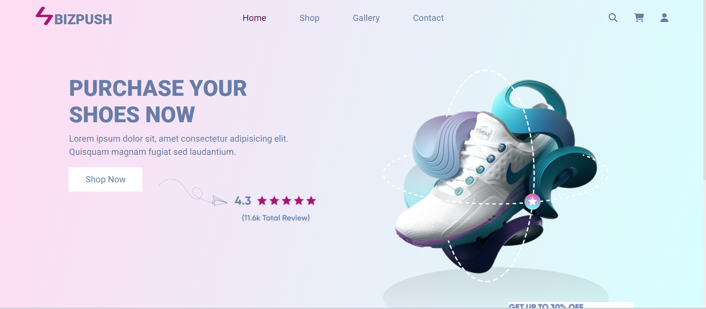
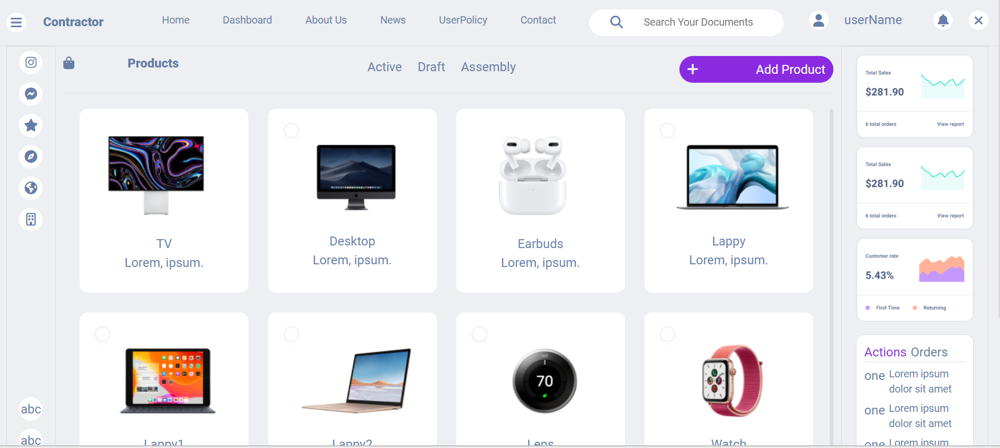

# Bizpush

Bizpush is a web application for an e-commerce store that specializes in shoes. It allows users to browse and purchase a variety of products. The application is built using React and React Router for client-side routing.

## Table of Contents

- [Introduction](#introduction)
- [Features](#features)
- [Demo](#demo)
- [Screenshots](#screenshots)
- [Deployment](#deployment)
- [Installation](#installation)
- [Usage](#usage)
- [Contributing](#contributing)
- [License](#license)

## Introduction

This web application provides an online shopping experience for shoe enthusiasts. It offers a user-friendly interface with features like product browsing, search, and secure payment options. The application is built using React, providing a responsive and interactive user interface.

## Features

- *Home Page*: Showcasing featured products and promotional banners to attract users and provide an overview of the store's offerings.
- *Product Catalog*: Browse a wide range of products with detailed information and images.

- *Responsive Design*: Access the application on various devices with a responsive layout.


## Demo

Here's a demo video showcasing the features and functionality of the Bizpush application: [Demo Video](https://drive.google.com/drive/folders/1k2MSYesfnt0wCO7pdZs67ODbAxmeWk2n?usp=sharing)

## Screenshots

<!-- - [Home Page](#home-page)
- [Shop Page](#shop-page) -->






## Deployment

The Bizpush application is deployed using Netlify and can be accessed at the following link: [Live Demo](https://pixel-assignment.vercel.app/)

## Installation

To run the Bizpush application locally, follow these steps:

1. Clone the repository:

   ```bash
   git clone https://github.com/JuleeRoy/pixelAssignment.git